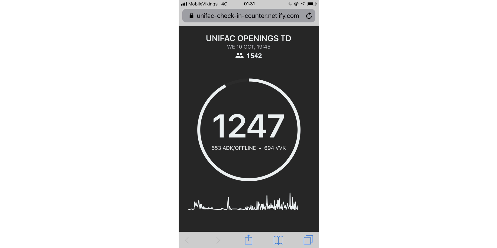

# Tickera check-in-counter

Application that talks to the Tickera API to count how many people are inside of an event venue and what ticket types they bought.

> Custom made for [Unifac](https://www.unifac.be/).

Made by [Wouter Landuydt](https://github.com/wouterlanduydt)
